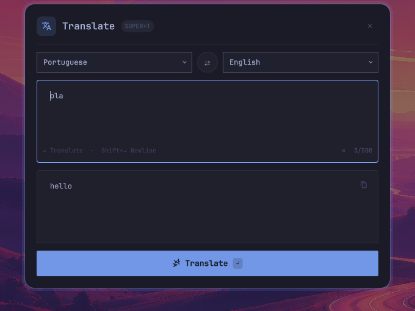
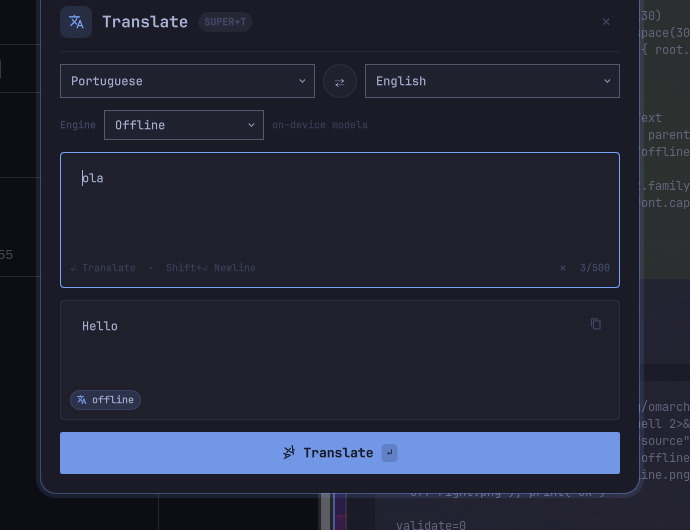

# omarchy-translate

A quick-translate overlay for [Omarchy](https://omarchy.org/). Press `SUPER+T`,
type text, hit `Enter` — the translation appears below, ready to copy.



## Engines: online and offline

The overlay has an **Engine** selector with two backends:

| Engine | How | Notes |
|---|---|---|
| **Online** (default) | Free MyMemory web API, no key | Needs network; anonymous daily quota; quota errors surface in the output card |
| **Offline** | On-device Argos Translate models | No network after setup; works on planes and behind firewalls; first translation per session takes a few seconds while models load |



> Note: Google ML Kit is Android/iOS-only and has no Linux build — Argos
> Translate is the equivalent on-device NMT tech on the desktop.

### Offline setup

No root needed. Install `uv`, create a venv, install the engine, download models:

```bash
curl -LsSf https://astral.sh/uv/install.sh | sh
uv venv ~/.local/share/carlos.translate/venv
uv pip install --python ~/.local/share/carlos.translate/venv/bin/python \
  argostranslate langdetect
export PATH="$HOME/.local/share/carlos.translate/venv/bin:$PATH"
argospm update
# one ~100MB package per direction; es/pt/fr/de <-> en shown here:
for p in en_es es_en en_pt pt_en en_fr fr_en en_de de_en; do
  argospm install translate-$p
done
```

Other pairs download **on demand** (needs network once): pick any language
combo in the widget and the helper fetches the model automatically. Source
auto-detect offline uses `langdetect` locally. Models live in
`~/.local/share/argos-translate` (~1GB for the 8 pairs above).

The helper prefers a system install when one provides both Python modules —
if you ever install Argos as an Omarchy package (e.g. `omarchy pkg aur add
argos-translate` in a terminal, plus a `langdetect` equivalent), the widget
uses it automatically and the venv is just a fallback. Language models are
shared via `~/.local/share/argos-translate` either way, so nothing is
downloaded twice. (Arch's official repos only carry `translate-shell`,
which is online-only, so the venv remains the recommended path.)

## Features

- **Overlay summoned with `SUPER+T`** — centered modal card on a scrim, `Esc` or click-outside to dismiss
- **18 languages + auto-detect** as source, 18 as target (English, Spanish, Portuguese, French, German, Italian, Japanese, Chinese, Korean, Russian, Arabic, Hindi, Turkish, Dutch, Polish, Swedish, Ukrainian…)
- **Animated swap button** — swaps source/target, and if there's already a result it swaps the texts and retranslates
- **Copy button with "Copied!" feedback** (copies via `wl-copy`)
- **Detected-language pill**, loading spinner, and inline error states in the output card
- **Character counter** (`n/500`) with clear button and shortcut hints (`↵ Translate · Shift+↵ Newline`)
- **Theme-integrated** — binds to Omarchy's `Color`/`Style` theme tokens, so it follows your theme
- **IPC prefill** — summon with text and it translates immediately:
  `omarchy-shell shell summon carlos.translate '{"text":"ola","source":"pt","target":"en"}'`
- **No API key** — translates through the free MyMemory API

## Requirements

- Omarchy (Hyprland + `omarchy-shell`)
- `wl-copy` (Wayland clipboard), `curl`, `python3`

## Install

### Option A — one command (recommended)

```bash
omarchy plugin add https://github.com/carlosveron/omarchy-translate --enable --yes
```

### Option B — manual

```bash
cp -r omarchy-translate ~/.config/omarchy/plugins/carlos.translate
omarchy-shell shell rescanPlugins
omarchy plugin enable carlos.translate
```

> The plugin is `keepLoaded`, so after editing its QML restart the shell once:
> `omarchy restart shell`

## Keybinding (`SUPER+T`)

`SUPER+T` ships as *toggle window floating/tiling* — unbind it first, in
`~/.config/hypr/bindings.lua`:

```lua
-- SUPER+T opens the translate overlay (was: toggle window floating/tiling).
hl.unbind("SUPER + T")
o.bind("SUPER + T", "Translate", "omarchy-shell shell toggle carlos.translate")
```

Then validate: `hyprctl reload && hyprctl configerrors`.

Optional — make the overlay pop instantly like the stock menu/emoji/clipboard
overlays, in `~/.config/hypr/hyprland.lua`:

```lua
hl.layer_rule({ match = { namespace = "^carlos-translate$" }, no_anim = true, animation = "none" })
```

## Usage

| Action | How |
|---|---|
| Open / close | `SUPER+T` (or `Esc`, or click the scrim) |
| Translate | `Enter` or the Translate button |
| Newline | `Shift+Enter` |
| Swap languages | ⇄ button between the selectors |
| Copy result | Copy button in the output card |
| Clear input | ✕ button inside the input card |

Prefill / script it:

```bash
# Toggle the overlay
omarchy-shell shell toggle carlos.translate
# Open with text (translates immediately), explicit languages optional
omarchy-shell shell summon carlos.translate '{"text":"Good morning!","source":"auto","target":"es"}'
# Offline engine from the start
omarchy-shell shell summon carlos.translate '{"text":"ola","source":"pt","target":"en","engine":"offline"}'
# Helper directly (either engine)
~/.config/omarchy/plugins/carlos.translate/bin/translate --to en --from pt "ola"
~/.config/omarchy/plugins/carlos.translate/bin/translate --to en --engine offline "ola"
```

## How it works

- `Translate.qml` — overlay UI (panel/overlay plugin, `keepLoaded: true`)
- `bin/translate` — helper: `--to <lang> [--from <lang>] [--engine online|offline] <text>`,
  always prints a single JSON object
  (`{"ok": true, "translated": …, "source": …, "engine": …}`).
  Online path parses `https://api.mymemory.translated.net/get`; offline path
  drives the Argos venv (`~/.local/share/carlos.translate/venv`).
- `manifest.json` — plugin manifest (`id: carlos.translate`, kind `overlay`)

Notes:

- MyMemory uses `autodetect` (not `auto`) as the source language — the helper maps it for you.
- The free anonymous quota is limited (~thousands of chars/day per IP) and each request is capped — the UI limits input to 500 chars. Quota/network errors surface inside the output card.
- The plugin id is yours (`carlos.*`); rename the folder + manifest `id` if you fork it.

## License

MIT — do what you want, no warranty.
